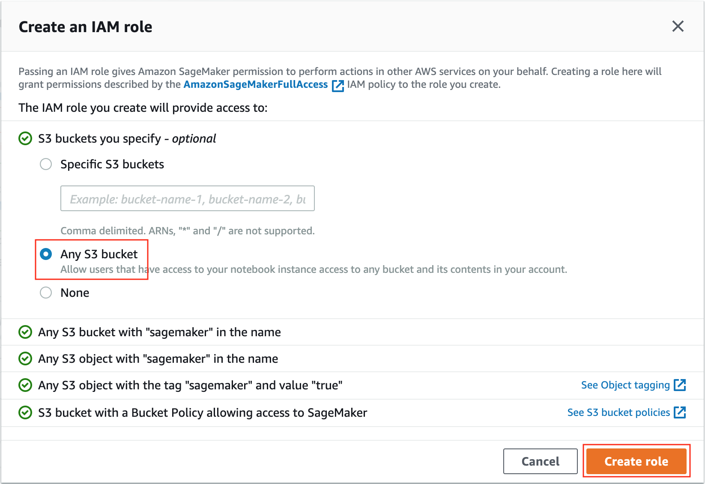

# Build, train & debug, and deploy & monitor with Amazon SageMaker

## Introduction

Amazon SageMaker is a fully managed service that removes the heavy lifting from each step of the machine learning workflow, and provides every developer and data scientist with the ability to build, train, and deploy machine learning (ML) models quickly. In this interactive workshop, we will work on the different aspects of the ML workflow to build, train, and deploy a model using all the capabilities of Amazon SageMaker including the ones that we announced at re:Invent 2019. We will use the Amazon SageMaker to build, train & debug models with Amazon SageMaker Debugger, and deploy & monitor with Amazon SageMaker Model Monitor. Let’s build together!


## Datasets

In this workshop, we will go through the steps of training, debugging, deploying and monitoring a **network traffic classification model**.

For training our model we will be using datasets <a href="https://registry.opendata.aws/cse-cic-ids2018/">CSE-CIC-IDS2018</a> by CIC and ISCX which are used for security testing and malware prevention.

These datasets include a huge amount of raw network traffic logs, plus pre-processed data where network connections have been reconstructed and relevant features have been extracted using CICFlowMeter, a tool that outputs network connection features as CSV files. Each record is classified as benign traffic, or it can be malicious traffic, with a total number of 15 classes.

The goal is to demonstrate how to execute training of a network traffic classification model using the Amazon SageMaker framework container for XGBoost, training and debugging. Once trained how to then deploy and monitor the model performance.


## Getting started

ℹ️ You will run this lab in your own AWS account. Please follow directions at the end of the lab to remove resources to minimize costs.

You can run this workshop in all commercial AWS regions where Amazon SageMaker is GA.

### Create a managed Jupyter Notebook instance

First, you will create an Amazon SageMaker managed Jupyter notebook instance.

An **Amazon SageMaker notebook instance** is a fully managed ML compute instance running the <a href="http://jupyter.org/">**Jupyter Notebook**</a> application. Amazon SageMaker manages creating the instance and related resources. 

1. Login to your AWS Account.

1. In **Services** menu, select **Amazon SageMaker**.


2. In the left navigation pane, click **Notebook instances**.

3. Click **Create notebook instance**, then configure:

- **Notebook instance name:** `Workshop`
- **Notebook instance type:** _ml.t2.medium_


3. In the **IAM role**, select **Create New Role** and configure:

- **S3 buckets:** ⊙ _None_
- Click **Create role**



1. Click **Create notebook instance** (at the bottom of the page).

A new Amazon SageMaker Notebook instance will be launched. It will take approximately 3 minutes to be ready.

1. Wait until the **Status** changes to **InService**.


1. Click **Open JupyterLab**.

The Jupyter Lab interface will load, as shown below:


### Download workshop code to the notebook instance

All the code of this workshop is implemented and available for download from this GitHub repository. You will clone the GitHub repository into the Amazon SageMaker notebook instance and access the Jupyter Notebooks to run the workshop.

1. From the file menu, click on **New > Terminal**.


This will open a terminal tab in the Jupyter Lab interface:


2. Copy and paste the following commands into the terminal:

```
cd SageMaker/
git clone https://github.com/aws-john/reinvent2019-aim362-sagemaker-debugger-model-monitor.git
```

When the clone operation completes, the folder **reinvent2019-aim362-sagemaker-debugger-model-monitor** will appear automatically in the file browser on the left (if not, you can hit the **Refresh** button)


1. Browse to the folder **01\_train\_and\_debug** and open the file **train\_and\_debug.ipynb** to get started.

## Modules

In this module of the workshop, you will execute various sections of the notebooks.

This workshops consists of 2 modules:

- <a href="01_train_and_debug/">**01\_train\_and\_debug**</a> - Train and debug with Amazon SageMaker Debugger
- <a href="02_deploy_and_monitor/">**02\_deploy\_and\_monitor**</a> - Deploy and Monitor with Amazon SageMaker Model Monitor

Here are some tips for using the notebook:

- A section can be run by clicking in the section and pressing **Shift+Enter** (or pressing the **Play** button at the top).
- Before a section is run, it will display: `[ ]:`
- While a section is running, it will display: `[*]:`
  - While a section is showing `[*]:`, **always wait** until the processing is finished!
- Once a section has finished running, it will display a number, such as: `[1]:`

1. Please read through the notebook, executing each section. Be sure to wait until a number (eg `In [1]:`) is displayed before continuing to the next section.

Once you have finished the **01 train and debug** module, go back a directory and open the **02 deploy and monitor** module.

## Clean-Up


## License

The contents of this workshop are licensed under the [Apache 2.0 License](./LICENSE).

## Authors

[Giuseppe A. Porcelli](https://it.linkedin.com/in/giuporcelli) - Principal, ML Specialist Solutions Architect - Amazon Web Services EMEA<br />
[Paul Armstrong](https://www.linkedin.com/in/paul-armstrong-532bb41) - Principal Solutions Architect - Amazon Web Services EMEA
